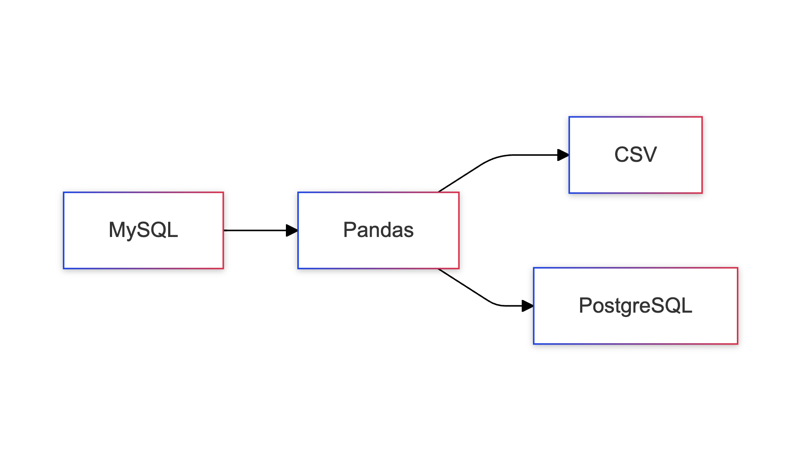

# WhatsApp Messages ETL Pipeline

## Overview

This project implements an ETL (Extract, Transform, Load) pipeline that processes WhatsApp messages data from MySQL,
transforms it, and loads the results into PostgreSQL and CSV files. The pipeline generates monthly message summaries for
different companies and divisions.



## Features

- Extracts WhatsApp messages data from MySQL database
- Processes and transforms message data into monthly summaries
- Loads transformed data into PostgreSQL database
- Generates individual CSV reports for each company
- Handles error logging and exception management
- Supports environment-based configuration

## Prerequisites

- Python 3.9+
- MySQL database
- PostgreSQL database
- Required Python packages (see `requirements.txt`)

## Installation

1. Clone the repository:

```bash
git clone https://github.com/Candratama/ETLProject.git
cd ETLProject
```

2. Create and activate virtual environment:

```bash
python -m venv .venv
source .venv/bin/activate  # For Unix/macOS
# or
.venv\Scripts\activate  # For Windows
```

3. Install required packages:

```bash
pip install -r requirements.txt
```

4. Create `.env` file with your database credentials:

```env
# MySQL Configuration
MYSQL_USER=your_mysql_user
MYSQL_PASSWORD=your_mysql_password
MYSQL_HOST=your_mysql_host
MYSQL_PORT=3306
MYSQL_DATABASE=your_mysql_database

# PostgreSQL Configuration
PG_USER=your_postgres_user
PG_PASSWORD=your_postgres_password
PG_HOST=your_postgres_host
PG_PORT=5432
PG_DATABASE=your_postgres_database
```

## Database Schema

### MySQL Tables

1. WAMessages
    - id (uuid)
    - client_id (int)
    - user_id (int)
    - status (varchar(10))
    - created_at (datetime)
    - updated_at (datetime)

2. Client
    - id (int)
    - name (varchar(100))
    - created_at (datetime)
    - updated_at (datetime)

3. User
    - id (int)
    - client_id (int)
    - name (varchar(100))
    - created_at (datetime)
    - updated_at (datetime)

### PostgreSQL Table

WAMessagesSummary

- id (integer)
- client_id (integer)
- name (varchar(100))
- name_user (varchar(100))
- month (varchar(10))
- message_count (integer)

## Usage

Run the ETL pipeline:

```bash
python main.py
```

The script will:

1. Extract data from MySQL
2. Transform the data into monthly summaries
3. Load the results into PostgreSQL
4. Generate CSV files in the `output/YYYY-MM` directory

## Code Structure

```
project/
├── main.py              # Main ETL script
├── requirements.txt     # Python dependencies
├── .env                # Environment variables
├── output/             # Generated CSV files
│   └── YYYY-MM/       # Monthly directories
└── README.md           # This file
```

### Main Components

1. **DatabaseConnection Class**
    - Handles database connection configuration
    - Creates MySQL and PostgreSQL engine instances

2. **DataProcessor Class**
    - Manages the ETL process
    - Contains methods for:
        - Data extraction (extract_data)
        - Data transformation (transform_data)
        - Data loading (load_data)

3. **Error Handling and Logging**
    - Comprehensive error catching
    - Detailed logging for monitoring and debugging

## Output

1. **PostgreSQL Table**
    - Stores monthly message summaries
    - Contains aggregated data per client and user

2. **CSV Files**
    - Generated in `output/YYYY-MM/` directory
    - One file per company
    - Contains columns:
        - Nama Perusahaan (Company Name)
        - Nama Divisi (Division Name)
        - Periode (Period)
        - Jumlah Pesan Terkirim (Message Count)

## Error Handling

The application includes comprehensive error handling for:

- Database connection issues
- Data transformation errors
- File system operations
- Data type conversions

Errors are logged with timestamps and detailed messages.

## Contact

[](https://www.linkedin.com/in/wahyucandratama/)